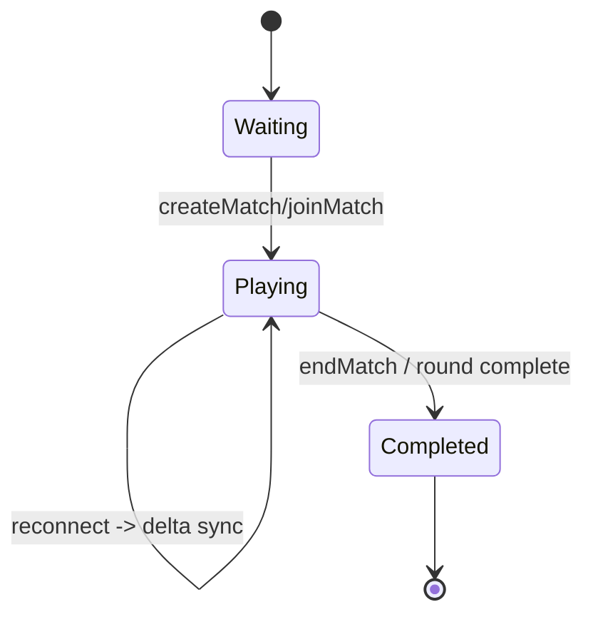
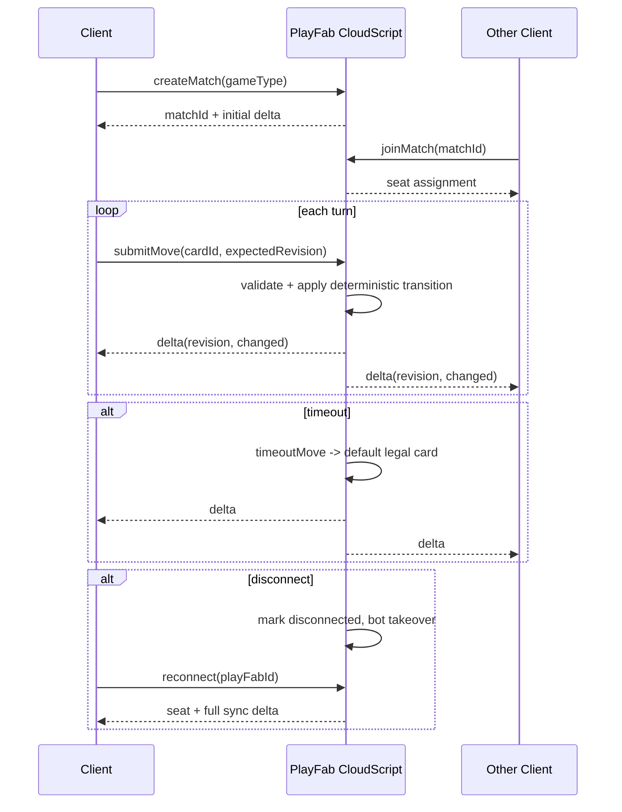

# Multiplayer Architecture (PlayFab)

## Overview
Server-authoritative architecture with deterministic state simulation.

- Client: Android (Capacitor + React)
- Transport: `Client -> PlayFab CloudScript -> Clients`
- Authority: Server only validates and mutates state
- Sync: Delta-only (`revision`, `changed`)
- Auth bootstrap: PlayFab `LoginWithCustomID` from client (`playfabAuth.ts`)

## Project Layout
- `/client/online`
  - `core/` deterministic engine + bot + emulator
  - `rules/` shared rules contracts and game implementations (`IGameRules`, `HeartsRules`, `SpadesRules`, `CallbreakRules`)
  - `network/` PlayFab + local adapter
  - `ui/` multiplayer indicators + radial timer
- Existing game entry components (`HeartsGame.tsx`, `SpadesGame.tsx`, `CallbreakGame.tsx`) route online mode into online orchestration.
- `/server/playfab/cloudscript`
  - `handlers.js` PlayFab API handlers
- `/docs`
  - architecture and operations docs

## APIs
CloudScript handlers implement:
- `createMatch`
- `joinMatch`
- `submitMove`
- `getState`
- `timeoutMove`
- `endMatch`
- `updateCoins`
- `reconnect`

## Economy
- Starting coins: 1000
- Entry fee: 50
- Rewards: 1st=100, 2nd=75, 3rd=25, 4th=0

## Deterministic State Model
State fields include:
- `deck`, `players`, `hands`, `turnIndex`, `currentTrick`, `scores`, `roundNumber`, `seed`

All mutations are pure transition operations with revision increments.

## Bot and Disconnect Policy
- 2 humans + 2 bots composition
- Bots always submit legal moves, with simulated delay
- Timeout is 5 seconds
- Timeout fallback move:
  - Hearts: lowest valid
  - Spades: lowest non-trump, else lowest
  - Callbreak: lowest legal
- Disconnect: seat is marked disconnected and bot takeover can continue turn progression
- Reconnect: seat restored with full state delta

## State Diagram

## Sequence Diagram

